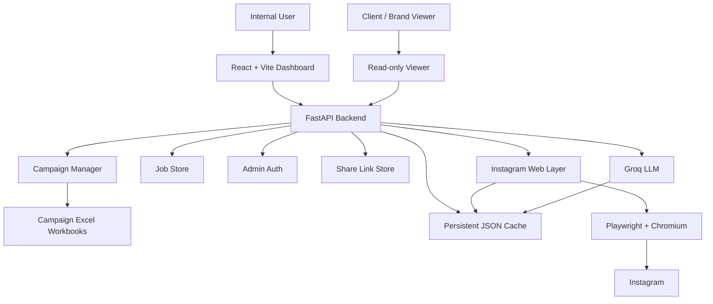
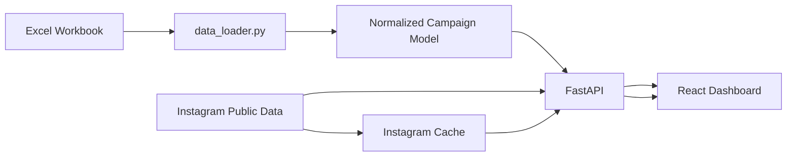
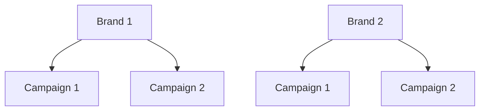
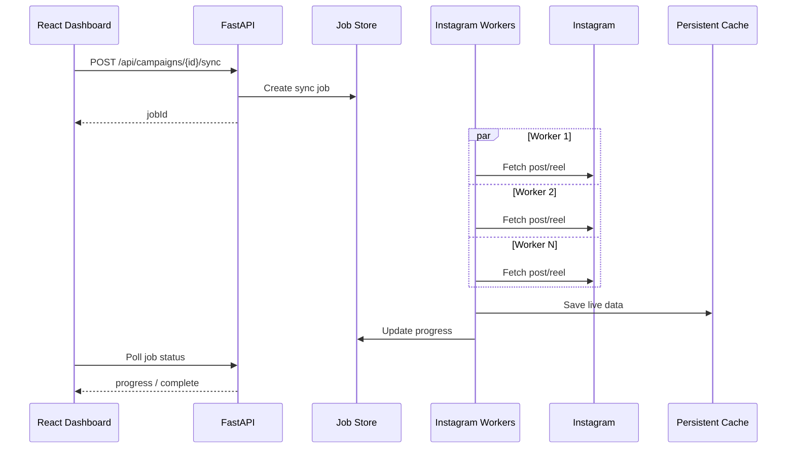
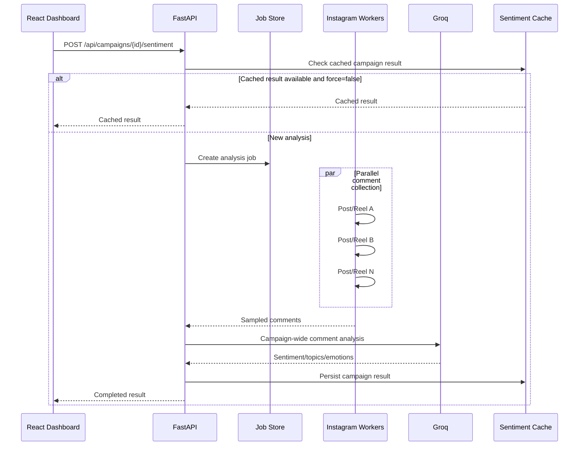
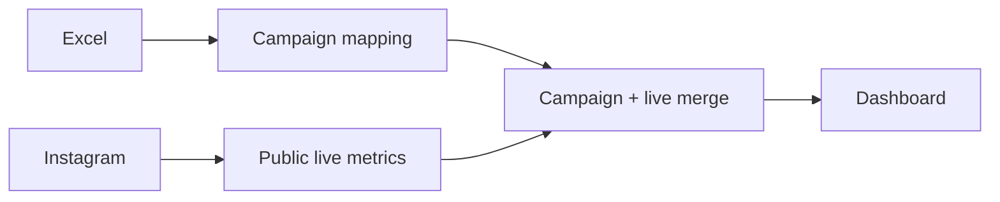
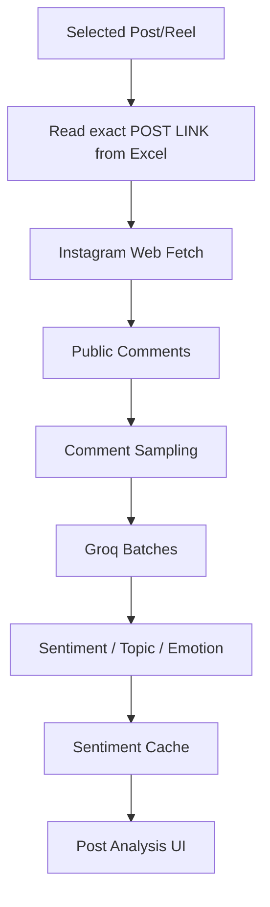
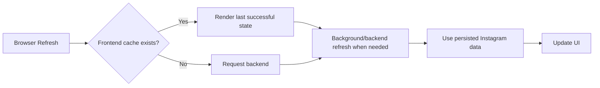
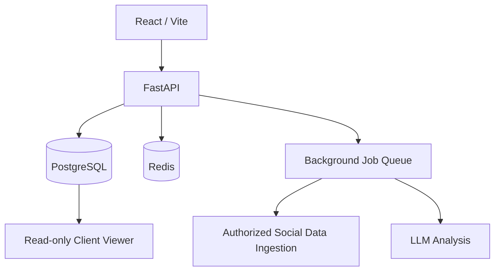

# Monk-E Campaign Intelligence Dashboard

A modular campaign analytics and AI audience-insights platform for influencer marketing campaigns.

The application combines campaign workbooks, Instagram web data collection, persistent caching, Groq-powered audience analysis, multibrand/multicampaign management, bulk synchronization, campaign-level sentiment analysis, and read-only share links.

The current prototype is designed around an Excel-first workflow: each campaign is represented by an Excel workbook, while Instagram is used to enrich the workbook data with public post-level data where available. The frontend is implemented with React + Vite, and the backend uses FastAPI, Playwright/Chromium, and Groq.

---

## 1. Key Capabilities

### Campaign management

The dashboard supports a hierarchy of:

```text
Brand
  ├── Campaign 1
  ├── Campaign 2
  └── Campaign 3

Another Brand
  ├── Campaign 1
  └── Campaign 2
```

Each campaign is created from an Excel workbook. The workbook is validated before it becomes part of the campaign registry.

The internal workspace supports:

- Adding a campaign by uploading `.xlsx` or `.xlsm`.
- Deleting campaigns.
- Switching between campaigns without changing the application code.
- Grouping campaigns by brand.
- Persisting the campaign registry across restarts.

### Campaign analytics

The dashboard provides:

- Overview KPIs.
- Reach and engagement analysis.
- Creator-level analytics.
- Category analytics.
- Post and Reel exploration.
- Instagram thumbnails.
- Public Instagram metrics where they are exposed to the browser.
- Live-data coverage indicators.
- Historical/fallback workbook metrics.

### Instagram enrichment

For a campaign, the application can synchronise all workbook `POST LINK` entries through the Instagram web layer.

The ingestion layer supports both posts and Reels and uses bounded concurrency for bulk fetching.

Publicly visible information can include:

- Likes.
- Comments count.
- Views/plays where exposed.
- Shares where exposed.
- Saves where exposed.
- Public thumbnail.
- Publicly visible comments.

Instagram access uses a saved authenticated Playwright state rather than storing credentials in the application code.

### Post-level AI audience analysis

A selected post or Reel can be analysed using comments collected from Instagram.

The analysis pipeline is:

```text
Excel POST LINK
      |
      v
Instagram web ingestion
      |
      v
Public comments
      |
      v
Sampling
      |
      v
Groq
      |
      v
Sentiment + topic + emotion
```

The analysis returns:

- Positive / neutral / negative sentiment.
- Confidence.
- Topic.
- Emotion.
- Short reasoning.
- Sample metadata.

Completed results are cached so the same post does not repeatedly trigger browser scraping and Groq calls.

### Campaign-level sentiment

Campaign sentiment removes the need to analyse posts manually one by one.

The campaign workflow is:

```text
Every post / Reel in campaign
            |
            v
Parallel comment collection
            |
            v
Per-post sampling
            |
            v
Campaign-wide sample
            |
            v
Groq analysis
            |
            v
Campaign sentiment dashboard
```

The campaign result includes:

- Overall sentiment distribution.
- Topics.
- Emotions.
- Post/Reel breakdown.
- Media mix.
- Collection coverage.
- Reel coverage.
- Partial/error information when some placements could not be collected.

Campaign-level results are persisted and reused until explicitly re-analysed or their configured cache period expires.

### Read-only POC sharing

An internal administrator can create a share link for selected campaigns belonging to a brand.

The shared viewer is intentionally separate from the internal admin workspace.

```text
Internal Admin
      |
      | create share link
      v
Share token
      |
      v
Read-only viewer
      |
      +--> Campaign analytics
      +--> Live/cached campaign data
      +--> Campaign sentiment
```

The viewer has no campaign upload, delete, admin, or management controls.

---

## 2. Architecture

### High-level system



### Campaign data flow



### Campaign hierarchy



### Bulk synchronization



### Campaign sentiment pipeline



### Share-link architecture

```mermaid
flowchart LR
    ADMIN[Admin Workspace] --> CREATE[Create Share Link]
    CREATE --> STORE[share_links.json]
    STORE --> TOKEN[/share/{token}/]
    TOKEN --> VIEW[Read-only Viewer]
    VIEW --> PUBLIC[/api/share/{token}]
```

---

## 3. Technology Stack

### Backend

- Python.
- FastAPI.
- Uvicorn.
- Pydantic.
- Pandas.
- OpenPyXL.
- python-dotenv.
- Playwright.
- Chromium.
- Groq SDK.

### Frontend

- React 18.
- Vite 6.
- Recharts.
- Lucide React.
- JavaScript.

The frontend is split into feature modules rather than keeping the complete application in one component.

---

## 4. Project Structure

```text
monke-campaign-dashboard/
├── backend/
│   ├── app/
│   │   ├── __init__.py
│   │   ├── admin_auth.py
│   │   ├── cache_store.py
│   │   ├── campaign_analysis.py
│   │   ├── campaign_manager.py
│   │   ├── comment_source.py
│   │   ├── data_loader.py
│   │   ├── instagram_login.py
│   │   ├── instagram_web.py
│   │   ├── job_store.py
│   │   ├── main.py
│   │   ├── sentiment.py
│   │   └── share_store.py
│   ├── tests/
│   │   ├── test_api.py
│   │   ├── test_core.py
│   │   └── test_multi_campaign.py
│   ├── .env
│   ├── .env.example
│   ├── debug_instagram.py
│   └── requirements.txt
│
├── data/
│   ├── campaigns/
│   │   ├── <brand>/
│   │   │   └── <campaign>.xlsx
│   │   └── ...
│   ├── instagram_cache/
│   │   ├── campaign.json
│   │   ├── post_live.json
│   │   ├── sentiment.json
│   │   └── campaign_sentiment.json
│   ├── campaign_registry.json
│   ├── share_links.json
│   └── instagram_profile/
│
├── frontend/
│   ├── src/
│   │   ├── components/
│   │   │   ├── auth/
│   │   │   ├── charts/
│   │   │   ├── common/
│   │   │   └── layout/
│   │   ├── features/
│   │   │   ├── campaignSentiment/
│   │   │   ├── categories/
│   │   │   ├── creators/
│   │   │   ├── insights/
│   │   │   ├── overview/
│   │   │   ├── posts/
│   │   │   ├── sentiment/
│   │   │   ├── viewer/
│   │   │   └── workspace/
│   │   ├── hooks/
│   │   ├── lib/
│   │   ├── App.jsx
│   │   ├── main.jsx
│   │   └── styles.css
│   ├── package.json
│   ├── package-lock.json
│   ├── vite.config.js
│   └── .env.example
│
└── README.md
```

The main application modules include campaign management, persistent cache handling, Instagram ingestion, sentiment analysis, background job tracking, administration, and share links. The source tree in the provided project includes these modules under `backend/app`. fileciteturn11file0L5-L16

---

## 5. Prerequisites

Install the following on the machine that will run the application:

- Python 3.11+.
- Node.js LTS.
- npm.
- `uv`.
- Git, if cloning from a repository.
- Chromium installed through Playwright.

Recommended checks:

```powershell
python --version
node --version
npm --version
uv --version
git --version
```

---

## 6. Clone or Copy the Project

Using Git:

```powershell
cd C:\Users\<YourName>\Desktop
git clone <YOUR_REPOSITORY_URL> monke-campaign-dashboard
cd monke-campaign-dashboard
```

Or extract the project ZIP and open PowerShell in the project directory.

---

## 7. Backend Setup with uv

From the project root:

```powershell
cd backend
uv venv
```

Activate the virtual environment on Windows PowerShell:

```powershell
.\.venv\Scripts\Activate.ps1
```

Install the backend requirements:

```powershell
uv pip install -r requirements.txt
```

Install Chromium for Playwright:

```powershell
uv run python -m playwright install chromium
```

Verify:

```powershell
uv run python -m playwright --version
```

---

## 8. Backend Environment Configuration

Create:

```text
backend/.env
```

A practical prototype configuration is:

```env
# ------------------------------------------------------------
# Groq
# ------------------------------------------------------------
GROQ_API_KEYS=YOUR_KEY_1,YOUR_KEY_2
GROQ_SENTIMENT_MODEL=openai/gpt-oss-20b
GROQ_SENTIMENT_SAMPLE_SIZE=75
GROQ_SENTIMENT_BATCH_SIZE=40
GROQ_SENTIMENT_CONCURRENCY=2
GROQ_SENTIMENT_RETRIES=1

# ------------------------------------------------------------
# Legacy workbook bootstrap
# ------------------------------------------------------------
CAMPAIGN_XLSX_PATH=../data/ASIAN PAINTS (1).xlsx
DEFAULT_CAMPAIGN_ID=
MAX_CAMPAIGN_UPLOAD_BYTES=26214400

# ------------------------------------------------------------
# Admin and POC viewer
# ------------------------------------------------------------
MONKE_ADMIN_KEY=replace-with-a-long-random-secret
PUBLIC_VIEWER_BASE_URL=http://localhost:5173

# ------------------------------------------------------------
# Instagram
# ------------------------------------------------------------
INSTAGRAM_USER_DATA_DIR=data/instagram_profile
INSTAGRAM_HEADLESS=true
INSTAGRAM_TIMEOUT_MS=45000
INSTAGRAM_INITIAL_WAIT_MS=1800
INSTAGRAM_COMMENT_WAIT_MS=700
INSTAGRAM_COMMENT_ROUNDS=6
INSTAGRAM_FETCH_CONCURRENCY=10
INSTAGRAM_SYNC_CONCURRENCY=10
INSTAGRAM_ALLOW_VISIBLE_PARALLEL=false
INSTAGRAM_CACHE_SECONDS=1800
INSTAGRAM_EMPTY_COMMENT_RETRY_SECONDS=900
INSTAGRAM_BROWSER_RECOVERY_ATTEMPTS=2

# ------------------------------------------------------------
# Campaign-wide sentiment
# ------------------------------------------------------------
CAMPAIGN_SENTIMENT_CACHE_SECONDS=86400
CAMPAIGN_COMMENTS_PER_POST=5
CAMPAIGN_SENTIMENT_MAX_COMMENTS=500
CAMPAIGN_SENTIMENT_FETCH_CONCURRENCY=5

# ------------------------------------------------------------
# Post sentiment cache
# ------------------------------------------------------------
SENTIMENT_CACHE_SECONDS=86400
```

### Environment variable reference

| Variable | Purpose |
|---|---|
| `GROQ_API_KEYS` | Comma-separated Groq credentials used for failover. |
| `GROQ_SENTIMENT_MODEL` | Groq model used for sentiment analysis. |
| `GROQ_SENTIMENT_SAMPLE_SIZE` | Default post-level sample size. |
| `GROQ_SENTIMENT_BATCH_SIZE` | Number of comments sent to Groq per batch. |
| `GROQ_SENTIMENT_CONCURRENCY` | Maximum concurrent Groq batches. |
| `GROQ_SENTIMENT_RETRIES` | Application-level retry count. |
| `CAMPAIGN_XLSX_PATH` | Legacy workbook path used for backwards-compatible bootstrap. |
| `DEFAULT_CAMPAIGN_ID` | Optional campaign selected as the default internal campaign. |
| `MAX_CAMPAIGN_UPLOAD_BYTES` | Maximum uploaded workbook size. |
| `MONKE_ADMIN_KEY` | Optional admin boundary for internal endpoints. |
| `PUBLIC_VIEWER_BASE_URL` | Base URL used when generating share links. |
| `INSTAGRAM_USER_DATA_DIR` | Playwright authentication/browser state directory. |
| `INSTAGRAM_HEADLESS` | Run Chromium visibly or headlessly. |
| `INSTAGRAM_TIMEOUT_MS` | Instagram page timeout. |
| `INSTAGRAM_INITIAL_WAIT_MS` | Initial page settling delay. |
| `INSTAGRAM_COMMENT_WAIT_MS` | Comment-load wait between interactions. |
| `INSTAGRAM_COMMENT_ROUNDS` | Maximum comment loading rounds. |
| `INSTAGRAM_FETCH_CONCURRENCY` | Maximum Instagram fetch workers. |
| `INSTAGRAM_SYNC_CONCURRENCY` | Maximum concurrent campaign-sync workers. |
| `INSTAGRAM_ALLOW_VISIBLE_PARALLEL` | Whether visible Chromium mode may use parallel workers. |
| `INSTAGRAM_CACHE_SECONDS` | Freshness period for public Instagram cache entries. |
| `INSTAGRAM_EMPTY_COMMENT_RETRY_SECONDS` | Retry period after an empty comment result. |
| `INSTAGRAM_BROWSER_RECOVERY_ATTEMPTS` | Maximum browser recovery attempts after a crash. |
| `CAMPAIGN_SENTIMENT_CACHE_SECONDS` | Campaign sentiment cache lifetime. |
| `CAMPAIGN_COMMENTS_PER_POST` | Maximum randomly sampled comments collected per placement during campaign sentiment collection. |
| `CAMPAIGN_SENTIMENT_MAX_COMMENTS` | Maximum campaign-wide comments sent to Groq. |
| `CAMPAIGN_SENTIMENT_FETCH_CONCURRENCY` | Maximum concurrent comment-collection workers for campaign sentiment. |
| `SENTIMENT_CACHE_SECONDS` | Post sentiment cache lifetime. |

Do not commit `backend/.env`.

---

## 9. Instagram Login State

The application expects a usable Playwright authentication state for Instagram data collection.

Use the provided login helper instead of storing a username/password in application code.

From `backend/`:

```powershell
uv run python -m app.instagram_login
```

Complete the login in the browser window that Playwright opens, then allow the helper to persist the browser state.

Do not commit or share:

```text
backend/data/instagram_profile/
storage_state.json
```

Treat the Playwright authentication state as a credential.

---

## 10. Start the Backend

From `backend/`:

```powershell
uv run uvicorn app.main:app --reload --port 8000
```

Backend URLs:

```text
http://localhost:8000
http://localhost:8000/docs
http://localhost:8000/health
```

---

## 11. Frontend Setup

Open a second PowerShell window.

```powershell
cd C:\Users\<YourName>\Desktop\monke-campaign-dashboard\frontend
npm install
```

Optional frontend environment file:

```text
frontend/.env
```

```env
VITE_API_URL=http://localhost:8000
```

Start Vite:

```powershell
npm run dev
```

Open:

```text
http://localhost:5173
```

---

## 12. Production Frontend Build

Build:

```powershell
cd frontend
npm run build
```

Preview the production build locally:

```powershell
npm run preview
```

The Vite build output is normally created in:

```text
frontend/dist/
```

---

## 13. First-Time Replication Checklist

Run these commands in order on a fresh Windows machine:

```powershell
# Project root
cd C:\Users\<YourName>\Desktop\monke-campaign-dashboard

# Backend
cd backend
uv venv
.\.venv\Scripts\Activate.ps1
uv pip install -r requirements.txt
uv run python -m playwright install chromium

# Create backend/.env and fill the values.

# Create Instagram login state
uv run python -m app.instagram_login

# Start backend
uv run uvicorn app.main:app --reload --port 8000
```

In another terminal:

```powershell
cd C:\Users\<YourName>\Desktop\monke-campaign-dashboard\frontend
npm install
npm run dev
```

Then open:

```text
http://localhost:5173
```

---

## 14. Campaign Management Workflow

### Add a campaign

1. Open the internal dashboard.
2. Open the Workspace / campaign management area.
3. Enter the brand name.
4. Enter the campaign name.
5. Upload `.xlsx` or `.xlsm`.
6. The backend validates the workbook before registration.
7. The workbook is copied into the campaign storage directory.
8. The campaign appears under the selected brand.

### Delete a campaign

Use the Workspace campaign management UI.

Deletion removes the campaign registry entry and stored campaign workbook for that campaign.

### Campaign storage

Campaign workbooks are stored under:

```text
data/campaigns/<brand>/<campaign>.xlsx
```

The campaign registry is persisted in:

```text
data/campaign_registry.json
```

The registry is created and maintained by `campaign_manager.py`.

---

## 15. Excel Workbook Expectations

The workbook is the mapping/source layer for campaign placements.

Typical fields include:

```text
Creator / Username
Profile Link
POST LINK
Followers
Reach
Engagement
Category
Placement Type
```

The exact workbook schema can vary. The loader normalizes the supported column names used by the current prototype.

A campaign must contain usable Instagram `POST LINK` rows before it can be registered.

### Example campaign workbook

```text
| USERNAME | POST LINK | FOLLOWERS | REACH | ENGAGEMENT | CATEGORY |
|----------|-----------|-----------|-------|------------|----------|
| creator1 | https://www.instagram.com/p/ABC... | 120000 | 45000 | 3200 | Reel |
| creator2 | https://www.instagram.com/reel/XYZ... | 90000 | 28000 | 2100 | Reel |
```

---

## 16. Live Data Model

The application deliberately keeps campaign and live sources separate.



Current source rules:

| Field | Primary source |
|---|---|
| Creator / username | Excel |
| Profile link | Excel |
| Post/Reel link | Excel |
| Campaign/category | Excel |
| Followers | Excel |
| Reach | Excel |
| Historical engagement | Excel |
| Live likes | Instagram public data |
| Live comments count | Instagram public data |
| Live views/plays | Instagram public data where exposed |
| Live shares | Instagram public data where exposed |
| Live saves | Instagram public data where exposed |
| Thumbnail | Instagram public data |
| Visible comments | Instagram public data |
| Post sentiment | Groq from collected comments |
| Campaign sentiment | Groq from campaign-wide comment sample |

The current prototype should not be interpreted as an owner-insights integration. Instagram public web pages do not reliably expose account-owner analytics such as true Reach or Impressions for arbitrary posts. The dashboard therefore keeps workbook Reach as the reach source.

---

## 17. Bulk Instagram Synchronization

The internal dashboard includes a campaign-level sync action.

Endpoint:

```http
POST /api/campaigns/{campaign_id}/sync
```

The backend creates a background job and fetches campaign posts/reels using bounded concurrency.

Status:

```http
GET /api/campaigns/{campaign_id}/sync/{job_id}
```

### Concurrency

The current implementation caps Instagram workers at 10.

Recommended:

```env
INSTAGRAM_FETCH_CONCURRENCY=10
INSTAGRAM_SYNC_CONCURRENCY=10
```

If Chromium is run visibly for debugging, keep parallelism conservative:

```env
INSTAGRAM_HEADLESS=false
INSTAGRAM_ALLOW_VISIBLE_PARALLEL=false
```

This avoids opening a large number of visible Chromium windows simultaneously.

---

## 18. Post-Level Sentiment

The post sentiment flow is:



Endpoint:

```http
POST /api/campaigns/{campaign_id}/sentiment/post/{post_id}
```

The implementation also accepts the `force=true` query parameter when a new analysis is required.

The browser layer uses:

- Visible DOM text.
- Structured DOM extraction.
- Instagram network responses where available.
- Embedded Instagram JSON data.
- Comment expansion controls.
- Incremental comment loading.

The extractor is intentionally defensive because Instagram can change its rendered HTML and data structures.

---

## 19. Campaign-Wide Sentiment

Endpoint:

```http
POST /api/campaigns/{campaign_id}/sentiment
```

Status:

```http
GET /api/campaigns/{campaign_id}/sentiment/{job_id}
```

Cached result:

```http
GET /api/campaigns/{campaign_id}/sentiment
```

### Collection strategy

For every campaign placement:

```text
Post / Reel
    |
    v
Collect available comments
    |
    v
Randomly sample up to CAMPAIGN_COMMENTS_PER_POST
    |
    v
Aggregate all sampled comments
    |
    v
Cap at CAMPAIGN_SENTIMENT_MAX_COMMENTS
    |
    v
Send campaign sample to Groq
```

The campaign result includes:

```text
summary
  positive / neutral / negative

topics

emotions

mediaMix
  post / reel

collection
  attempted posts
  posts with comments
  comments collected
  sampled comments
  reels
  reels with comments

postBreakdown

partial

errors
```

---

## 20. Caching Strategy

The prototype deliberately avoids re-fetching and re-running expensive work after every browser refresh.

### Backend cache

Persistent JSON stores are used for:

```text
data/instagram_cache/campaign.json
data/instagram_cache/post_live.json
data/instagram_cache/sentiment.json
data/instagram_cache/campaign_sentiment.json
```

The cache store writes atomically so a partial JSON write is avoided during normal operation.

### Frontend cache

The React application stores the selected campaign and cached campaign/live/sentiment data in browser storage through the frontend cache utility.

### Practical behavior



Explicit `force=true` operations are available when fresh data is required.

---

## 21. Read-Only Share Links

### Create

Internal admin endpoint:

```http
POST /api/admin/share-links
```

Request body:

```json
{
  "brand": "Asian Paints",
  "campaignIds": [
    "asian-paints-main-campaign-3c73e05bef"
  ],
  "label": "Asian Paints Client POC"
}
```

The response contains a share URL based on `PUBLIC_VIEWER_BASE_URL`.

Example:

```text
http://localhost:5173/share/<token>
```

Production example:

```env
PUBLIC_VIEWER_BASE_URL=https://view.example.com
```

Then the generated URL can look like:

```text
https://view.example.com/share/<token>
```

### Public share endpoint

```http
GET /api/share/{token}
```

Only the campaigns included in the token are returned.

The viewer can see the prepared campaign intelligence but does not receive the internal campaign-management API surface.

---

## 22. Admin Authentication

The prototype supports a lightweight admin boundary through:

```env
MONKE_ADMIN_KEY=your-secret
```

If configured, internal endpoints expect:

```http
X-Admin-Key: your-secret
```

The frontend stores the key only in the current browser session.

For a production deployment, replace this lightweight boundary with a proper identity provider, session management, roles, and database-backed authorization.

---

## 23. API Reference

### Health

```http
GET /health
```

### Campaign catalog

```http
GET /api/admin/campaigns
```

### Upload campaign workbook

```http
POST /api/admin/campaigns/upload
```

Multipart form fields:

```text
brand
campaign
file
```

### Delete campaign

```http
DELETE /api/admin/campaigns/{campaign_id}
```

### Create share link

```http
POST /api/admin/share-links
```

### List share links

```http
GET /api/admin/share-links
```

### Delete share link

```http
DELETE /api/admin/share-links/{token}
```

### Public share

```http
GET /api/share/{token}
```

### Internal campaign data

```http
GET /api/campaigns/{campaign_id}
```

### Internal campaign post

```http
GET /api/campaigns/{campaign_id}/post/{post_id}
```

### Live post

```http
GET /api/campaigns/{campaign_id}/posts/{post_id}/live
```

Optional:

```text
?force=true
```

### Bulk Instagram sync

```http
POST /api/campaigns/{campaign_id}/sync
```

### Bulk sync status

```http
GET /api/campaigns/{campaign_id}/sync/{job_id}
```

### Campaign sentiment start

```http
POST /api/campaigns/{campaign_id}/sentiment
```

Optional:

```text
?force=true
```

### Campaign sentiment job status

```http
GET /api/campaigns/{campaign_id}/sentiment/{job_id}
```

### Campaign sentiment cache

```http
GET /api/campaigns/{campaign_id}/sentiment
```

### Post sentiment

```http
POST /api/campaigns/{campaign_id}/sentiment/post/{post_id}
```

Optional:

```text
?force=true
```

---

## 24. Debugging Instagram

For visible debugging:

```env
INSTAGRAM_HEADLESS=false
INSTAGRAM_ALLOW_VISIBLE_PARALLEL=false
```

Restart the backend:

```powershell
uv run uvicorn app.main:app --reload --port 8000
```

Or run the standalone debug helper:

```powershell
cd backend
uv run python debug_instagram.py
```

Use it to inspect:

- Current Instagram URL.
- Page title.
- Login state.
- Visible page text.
- Comment visibility.
- Extracted comments.
- Saved HTML/debug screenshots when enabled by the script.

### Common Playwright problems

#### `Page crashed`

The current Instagram layer includes browser recovery attempts. Check:

```env
INSTAGRAM_BROWSER_RECOVERY_ATTEMPTS=2
```

Reinstall Chromium if required:

```powershell
uv run python -m playwright install chromium
```

#### Browser profile locked

Do not run multiple processes against the same persistent profile directory simultaneously.

Stop stale backend/browser processes and restart the backend.

#### No comments extracted

Possible causes include:

- No public comments.
- Comments disabled.
- Instagram login/challenge page.
- Limited page content.
- Instagram changed the page structure.
- Temporary browser failure.

Use the debug helper with visible Chromium to determine which case applies.

---

## 25. Testing

The backend test suite is located under:

```text
backend/tests/
```

Run the tests with:

```powershell
cd backend
uv run python -m pytest -q
```

The project also contains compile/import checks and API-oriented tests in the current test suite.

### Frontend build

```powershell
cd frontend
npm run build
```

### Recommended smoke test

After starting both services:

```text
1. Open the dashboard.
2. Confirm the campaign catalog loads.
3. Select a campaign.
4. Open Overview.
5. Open Posts.
6. Run Fetch All / campaign sync.
7. Confirm live data appears without requiring manual post-by-post navigation.
8. Open AI Sentiment.
9. Run a post-level analysis on a Post and a Reel.
10. Run campaign sentiment.
11. Refresh the browser and verify cached results reappear.
12. Create a share link.
13. Open the share link in a private/incognito browser window.
14. Verify the shared viewer is read-only.
```

---

## 26. Git and Repository Hygiene

Recommended `.gitignore` entries:

```gitignore
# Environment
.env
.env.*
!.env.example

# Python
.venv/
__pycache__/
*.pyc
*.pyo

# Node
node_modules/
dist/
.vite/

# Runtime campaign/cache data
data/instagram_cache/
data/campaign_registry.json
data/share_links.json
data/.upload_tmp/

# Instagram authentication state
backend/data/instagram_profile/
data/instagram_profile/
storage_state.json
**/storage_state.json

# Debug artifacts
backend/instagram_debug.html
backend/instagram_debug.png
*.log

# IDE
.vscode/
.idea/
```

Commit the workbook files only when they are intended to be part of the repository. Do not commit private client files, secrets, authentication state, or generated runtime caches.

---

## 27. Example Git Workflow

```powershell
cd C:\Users\<YourName>\Desktop\monke-campaign-dashboard

git status
git add .
git commit -m "feat: update campaign intelligence dashboard"
git push origin main
```

---

## 28. Security Notes

Never commit or paste into source control:

```text
GROQ API keys
MONKE_ADMIN_KEY
Instagram credentials
storage_state.json
Playwright browser profile data
Private client campaign files
```

The Instagram profile directory contains browser state and can contain authentication material. The current project tree includes that runtime directory during development, but it should remain ignored and local. fileciteturn11file0L17-L25

The current JSON cache implementation is intentionally a lightweight single-process prototype cache. It is human-readable and uses atomic replacement, but it is not intended to replace a production database or distributed cache.

---

## 29. Known Prototype Boundaries

This version is a functional prototype rather than a production SaaS architecture.

### Excel remains the campaign source layer

Campaign files are stored and registered locally. A future production system should move campaign metadata and placements into a database while preserving Excel import/export.

### Instagram is browser-driven

The web extraction layer depends on the public information that Instagram renders to the authenticated Playwright session. Instagram can change the DOM, network payloads, login requirements, or public-data availability.

### Public metrics are different from owner analytics

The application can collect metrics exposed on the public web page, but true owner-level Reach, Impressions, and other account insights should come from an authorized platform API when available.

### Lightweight authentication

`MONKE_ADMIN_KEY` is appropriate for a controlled prototype. A production deployment should use proper authentication and authorization.

### JSON persistence

The current prototype uses local JSON files for the campaign registry, cache, jobs, and share-link records. For multi-instance deployment, use a transactional database and a shared cache such as Redis.

---

## 30. Recommended Production Evolution



Recommended next steps:

1. Replace local campaign JSON registry with PostgreSQL.
2. Keep Excel upload as an import pipeline.
3. Move long-running Instagram and AI jobs to a durable queue.
4. Add Redis for shared caching and job coordination.
5. Add proper user accounts and role-based authorization.
6. Add authorized Meta/Instagram professional-account APIs where appropriate.
7. Store metric history for time-series reporting.
8. Store comments and AI analyses in a database instead of large JSON files.
9. Add campaign comparison and creator benchmarking.
10. Add scheduled ingestion and automatic sentiment refresh.

---

## 31. Quick Reference

### Start backend

```powershell
cd backend
.\.venv\Scripts\Activate.ps1
uv run uvicorn app.main:app --reload --port 8000
```

### Start frontend

```powershell
cd frontend
npm run dev
```

### Install backend dependencies

```powershell
cd backend
uv pip install -r requirements.txt
uv run python -m playwright install chromium
```

### Login to Instagram

```powershell
cd backend
uv run python -m app.instagram_login
```

### Run backend tests

```powershell
cd backend
uv run python -m pytest -q
```

### Build frontend

```powershell
cd frontend
npm run build
```

---

## 32. Summary

Monk-E Campaign Intelligence turns Excel-based influencer campaign data into a modular analytics workspace with Instagram enrichment and AI audience insights.

The current architecture provides:

- Multibrand and multicampaign management.
- Excel campaign ingestion.
- Live/cached Instagram post and Reel enrichment.
- Parallel campaign synchronization.
- Post-level sentiment analysis.
- Campaign-wide sentiment analysis.
- Persistent browser, backend, and frontend caching.
- Background sync and sentiment jobs.
- Admin campaign management.
- Read-only brand/client share links.
- Modular React frontend.
- FastAPI backend.
- Playwright/Chromium Instagram access.
- Groq-powered audience analysis.

The project is structured so the Excel/browser prototype can later evolve into a database-backed, authorized-data ingestion platform without discarding the dashboard layer.
